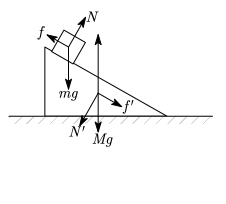

$$
\def\dif{{\rm d}}
\def\der#1#2{\frac{\dif #1}{\dif #2}}
\def\ve#1{\mathbf{#1}}
$$
## Chapter 2 牛顿三定律和质点动力学

### § 2.1 牛顿三定律的引入

牛顿（Isaac Newton）是伟大的物理学家。在伽利略奠定了科学推理的方法并对动力学有一定研究之后，牛顿继承了伽利略的思想，并用其发明的微积分方法，将动力学完善完毕。其重要成果之一就是奠定了力学的基础，定义了力的概念，并将关于力相关的公理应用于一个具体的例子：万有引力，并给出了惯性质量=引力质量这一关键论断。下面我们重点要说的就是关于“力”这一概念的三条公理，又被称为牛顿三定律。  
#### § 2.1.1 牛顿第一定律
> [!note] 牛顿第一定律
> 每个物体都要保持静止或匀速直线运动状态，除非有外力迫使其改变。
 
这个“公理”其原型是伽利略提出的思想实验，如果一个小球从斜面下滚下，再从斜面滚上，那么不断减小斜面的摩擦效应（这时不好说摩擦力此概念），那么小球达到的高度会不断接近原高度。伽利略作出了第一个推断：
>[!note] 命题1
>如果摩擦效应消失，那么小球应该能够刚好达到原高度。

接着，伽利略做了一个思想实验，他将斜面不断放平，发现小球能上升到的高度虽然略降低了些，但是于原来的高度相差无几。结合上个推论，他设想将一个无摩擦的面“放平”，那么小球仍会上升到原高度，直至完全水平，小球仍会有趋向原高度的“趋势”，那么会一直运动下去。也即
>[!note] 命题2
>物体在没有其他额外作用（后来牛顿称之为外力作用）时会一直保持运动，其运动快慢保持。

这一点后来被牛顿吸收，作为一条公理存在，也即牛顿第一定律。这个定律定义了一个参考系，称作惯性系，其中第一定律成立。这一参考系，即“绝对空间”本身，在牛顿的时空观下存在，一般认为地球即一个比较好的惯性系。但事实告诉我们：力的概念是片面的，只有测量两个物体的相对运动才有意义，不存在这样的参考系，同学们可以就这点展开思考。  

#### § 2.1.2 牛顿第二定律
$\qquad$牛顿第二定律是牛顿力学的最精髓的一条。如下
> [!note] 牛顿第二定律
> $F=\der{p}{t}=\der{(mv)}{t}$

这个定义引入了“运动量”，现在常称为动量，这个概念在牛顿第二定律中不甚重要，我们先略去。在将m视为常量的情形下，有
$$
F=m\frac{d}{dt} v=ma
$$
这个式子定义了“力”这一概念。力是一个间接概念，我们能够直接测量的只有位移，时间，所以牛顿第二定律与力的形式构成了一组耦合的方程，这样的方程在物理学中有很多，例如电磁学中场和源的耦合方程，哈密顿正则方程等等。或者说其实没有写成这样的形式的物理都是“简单”的，因为他们由一个微分方程来描述：如果随时的演化是线性的，那么总是e指数形式等。但是并非说不是这样的方程就没有物理意义，因为很重要的一点是，它们随空间位置的变化仍然会影响很多。但像牛二定律这样的耦合方程在物理中是很重要的。

在正常的需要应用牛顿力学的情景中，只需要把上面的牛二定律视为力的定义式，我们在题目和研究中遇到的力随位置的变化视作一种“实验规律”或“题目条件”即可。我们给出一个例题：
>[!note] 例题 2.1.1
$\qquad$我们发现：两个物体间有万有引力作用$F_{2\to1}=-\frac{GMm}{r^{2}}$其中$m,M$分别为1，2两物体的质量，固定1物体。求2物体的运动。

解:
$\qquad$应用牛顿第二定律
$$
m\frac{\dif^2 r}{\dif t^2}=F=-\frac{GMm}{r^2}
$$
容易验证二阶导满足常见代换
$$
\ddot{r}=\frac{1}{2}\der{\dot{r}^2}{r}
$$

作此代换，于是
$$
\frac{1}{2}m\dot{r}^2=\frac{GMm}{r}-\frac{GMm}{r_{0}}
$$
那么
$$
\begin{aligned}
\dot{r}=\sqrt{ 2Gm }\sqrt{ \frac{1}{r}-\frac{1}{r_{0}} }
\Rightarrow \frac{\dif r}{\sqrt{ \frac{1}{r}-\frac{1}{r_{0}} }}=\sqrt{ 2GM }\dif t
\end{aligned}
$$
作代换$r=r_{0}\sin^2{\theta},\dif{r}=2r_{0}\sin \theta \cos \theta \dif{\theta}$
$$
\frac{2r_{0}\sin \theta \cos \theta\dif{\theta}}{\frac{1}{{ r_{0} } }\frac{\cos\theta}{\sin \theta}}=2 r_{0}^{3/2}\sin^2\theta \dif{\theta}=\sqrt{ 2GM }\dif{t}
$$
积分
$$
\theta-\frac{1}{2} \sin 2\theta=\sqrt{ \frac{GM}{2r_{0}^3} }t
$$
反解即得。特别的，第一次从$r=0$回到此处，时间为
$$
\Delta t=\pi \sqrt{ \frac{2r_{0}^3}{GM} }
$$
再给出一个经典的例题

>[!note] 例题 2.1.2
 弹簧竖直，一端连小球，质量为$m$，另一端连着天花板，弹簧原长设为$0$，劲度系数为$k$，重力加速度为$g$，以天花板为原点，竖直向下为正方向。设初始条件为小球位置速度$x_{0},v_{0}$，求解小球的运动。   
 
 解：
$\qquad$我们先写出运动方程
$$
m \ddot{x}=-kx+mg=-k\left( x-\frac{mg}{k} \right)
$$
作代换$x'\to x-\frac{mg}{k}$，其实质上代表着振动平衡点的偏移。
那么
$$
m \ddot{x}'=-kx'
$$
这里可以同上作常见代换，也可以使用常系数二阶微分方程的特征根法。
__*法一：*__
常见代换
$$
\begin{gathered}
\frac{1}{2}m\der{\dot{x}'^2}{x}=-kx'\\
\Rightarrow \dif{(m\dot{x}^2+kx^2)}=0,m\dot{x}^2+kx^2=C
\end{gathered}
$$
我们凑出了一个不变化的量，即守恒量。我们后面会知道，这就是能量守恒。可以得到一个特解$x=A\cos (\omega t+\phi_{0})$反解出$\omega=\sqrt{ \frac{k}{m} }$可以验证自由度刚好符合，故这是唯一解
__*法2：*__
特征根法是对如下方程
$$
a_{n}\der{^n}{^nx}y+\dots+a_{1}\der{}{x}y+a_{0}y=0
$$
找出方程
$$
a_{n}\lambda^n+\dots+a_{1}\lambda+a_{0}=0
$$
其根，为$\lambda_{1},\lambda_{2},\dots,\lambda_{n}$，那么原方程的解为
$$
y=C_{1}e^{\lambda_{1}x}+\dots+C_{n}e^{\lambda_{n}x}
$$
套进原方程，得
$$
y=Ae^{i\sqrt{ \frac{k}{m}}t}+Be^{ -i\sqrt{ \frac{k}{m} }t }
$$
由于一定是实数，所以也可表为上述形式，这里不再赘述。
#### § 2.1.3 牛顿第三定律
牛顿第三定律是对力的一个性质的解析，其概念通俗易懂：
>[!note] 牛顿第三定律
>一个物体对另一个物体施力，那么它必须要受到一个在同一直线上，大小相等方向相反的力。

这个定律是在大量的实验观测下决定的。但事实证明，这条定律是动量角动量在牛顿体系下的结论。出于一种“生活经验”，一个物体在给人以作用时，往往都是人在主动给予其作用，在观察下，牛顿将其总结为定律，并对这组力命名为“作用力”、“反作用力”。
这条定律还给出：作用力和反作用力具有相同性质，例如万有引力的反作用力也是万有引力。
牛顿的时空观造就了这一个定律，并在牛顿力学的适用范围中成立。但是也有一定局限，麦克斯韦的电磁方程告诉我们，两个运动电荷之间的力并不满足牛顿第三定律，但这已经属于狭义相对论的范畴。

### § 2.2 常见力的形式
#### § 2.2.1 基本力
万有引力满足
$$
\vec{F}=\frac{Gm_{1}m_{2}}{r^2}\hat{r}
$$
方向是沿两物体的连线，并为引力
静电荷之间力满足库仑定律
$$
\vec{F}=k \frac{q_{1}q_{2}}{r^2}\hat{r}
$$
与万有引力的方向定义方向相反，同性相斥异性相吸。
电磁力满足
$$
\vec{F}=q\vec{E}+q \vec{v}\times \vec{B}
$$
其中$\vec{E},\vec{B}$是矢量场，一个静止的电荷仅仅产生电场，其形式以库仑定律的形式给出。
#### § 2.2.2 弹力
弹力是我们在经典力学中常见的一个处理对象。其包含弹簧的弹力，面的支持力，绳的张力等等。我们把这种由于某种形变而引起的力统称为弹力。支持力比较特别，它是由于某种非常微小的形变而引起的，以至于我们可以将其看作“被动”力，而弹力常常是主动的，只由位移引起的。被动力的成因是物体需要被保持在一个约束下：比如固定在一个面上。
我们已经研究了弹簧所导致的运动[[Mech_2#例题 2.1.2]]，这里引用一下这个运动
$$
x=A\cos(\omega t+\phi_{0})
$$
这被称为**简谐振动**，在物理学中是一个非常典型的函数，在各个领域都有出现。在经典物理中，弹簧作为一个简谐振子，就会产生这样的运动。这是由于其力与位移的大小成正比的性质引起的，具体而言，一些弹力的形式为
$$
F=-kx
$$
其中x是偏离平衡（不受力）位置的距离，而k则是一个常数，称为**劲度系数**。
有些连续体（如弹性绳，固体）会具有内部变形能力，常常用**杨氏模量**这个概念来描述，具体而言，对于一个微元$\dif{V}=\dif{l}\dif{\sigma}$，其固有的力是
$$
\dif{F}=E\dif{u}\dif{\sigma}
$$
其中$\dif{u}$代表在l方向，这个微元长度变化。
#### § 2.2.3 摩擦力
经过实验表明，摩擦力分为两种，分别是干摩擦和湿摩擦。下面我们分别来讨论。
__(1) 干摩擦__
干摩擦是由于接触面之间的粗糙接触造成的。由于这种原因，干摩擦只与接触面的材质和面之间的压力有关。公式为
$$
f_{fric}=\mu F_{sup}
$$
其中$f_{fric}$为摩擦力，常常简写为$f$，$F_{sup}$为支持力（正压力）,常常简写为$N$,$\mu$是由接触面材质决定的常数。
上述式子决定了摩擦力的大小，而其方向是沿着两个物体相对运动的反方向。读者可能有些难以理解这个概念，接下来用一个例题来理解
>[!note] 例题 2.2.1
一位同学特别喜欢在课堂上搓手，接下来对其进行建模。
假设两块板子，主动压力为$N$，上下交错，摩擦系数为$\mu$，如下图，下方板的速度为$\vec{v_{1}}=v_{1}\hat{x}$，上方板的速度为$\vec{v_{2}}=v_{2}\hat{y}$，求上方板收到的的摩擦力。
###### 解：
以下方板为参考系，上方板的速度为
$$
\vec{u}=\vec{v_{2}}-\vec{v_{1}}=-v_{1}\hat{x}+v_{2}\hat{y}
$$
那么摩擦力的方向朝着$-\vec{u}$方向，大小为$\mu N$，可表示为
$$
\begin{gathered}
\vec{f}=-\mu N \frac{\vec{u}}{|\vec{u}|}\\
=\mu N \frac{v_{1}}{\sqrt{ v_{1}^{2}+v_{2}^{2} }}\hat{x}-\mu N \frac{v_{2}}{\sqrt{ v_{1}^{2}+v_{2}^2 }}\hat{y}
\end{gathered}
$$
其不与参考系有关，因相对速度和力本身不与参考系有关。

除了具有相对速度的两个物体之间会有摩擦力，相对静止的物体之间也可有摩擦力。因为外力不足，若外力导致摩擦力而使物体间有相对运动时，会使物体瞬间暂停，此时就会有静摩擦力。静摩擦力是一种受到外力影响的力，简而言之，静摩擦力会随着外界的力改变而改变。到了一个临界点，静摩擦力会转变为动摩擦力，通常这个临界点时，静摩擦力要比动摩擦力大些，此时，静摩擦力也与正压力成正比，记为$f_{s}=\mu_{s}N$，且通常来讲，$\mu_{s}>\mu$，静摩擦力的方向无法简单判断，可能在突然滑动后，摩擦力方向会突变。

__(2) 湿摩擦__
湿摩擦主要是因为物体与流体接触，流体分子间的力并不牢固，导致流体可以对物体有等效压强的作用，这个压强在物体与流体没有相对接触时矢量和为0，但当物体运动时，湿摩擦的作用便体现出来。通常来讲，湿摩擦的作用与物体运动速度有关。当流体的黏性较大，物体较小时，阻力的大小同相对速度的大小成正比，即
$$
\vec{f}=-\gamma \vec{v}
$$
以上。

### § 2.3 非惯性系中的动力学

我们在前面已经给出了非惯性系下物体的运动学变换公式，我们接下来要做的就是将非惯性系下的力学公式也改写之。

#### § 2.3.1 平动非惯性系中的动力学

[[Mech_1#§ 1.3.1 参考系之间的平动]]
平动非惯性系上的运动学是
$$
\begin{cases}
\vec{r}'=\vec{r}-\vec{r_{0}} \\
\vec{v}'=\vec{v}-\vec{v_{0}} \\
\vec{a}'=\vec{a}-\vec{a_{0}}
\end{cases}
$$
首先有原系下，牛顿第二定律成立
$$
\vec{F}=m \vec{a}
$$
那么，在非惯性系中
$$
\vec{F}=m(\vec{a'}+\vec{a_{0}})
$$
于是
$$
\vec{F}-m \vec{a_{0}}=m \vec{a'}
$$
 如果要让牛顿第二定律继续成立，需要增加一个力
$$
\vec{f}=-m \vec{a_{0}}
$$
被称为惯性力。注意：只要座标架没有旋转，均可以引入惯性力。例如在一个作简谐振动的物体的非惯性系下也可以引入惯性力，此时惯性力也正弦式变化。
换惯性系的做法在物体相对另一个运动的物体的运动比较简单时较为适用，如下题
>[!note] 例题 2.3.1
>一个物体从斜面上滑下，斜面上有摩擦$\mu$，地面光滑，并有重力加速度$g$，物体与斜面的质量分别为$m,M$，斜面倾角为$\theta$，求解物体的运动。

解：
先分析受力，如图

我们就此可以获得大物块的加速度
$$
a_{M}=\frac{f'\cos \theta-N'\sin \theta}{M}
$$
力有如下关系
$$
N'=N,f'=f=\mu N
$$
那么
$$
a_{M}=\frac{N}{M}(\mu \cos \theta-\sin \theta)
$$
所以小物块在大物块系下受到惯性力$-ma_{M}$，从小物块进行分析
$$
\left\{
\begin{gathered}
\frac{m}{M}N(\mu \cos \theta-\sin \theta)\sin \theta+N=mg\cos \theta \\
mg\sin \theta +\frac{m}{M}N(\mu \cos \theta-\sin \theta)\cos\theta-\mu N=ma_{m}'
\end{gathered}
\right.
$$
由1式知
$$
N=\frac{mMg\cos \theta}{m(\mu \cos \theta -\sin \theta)\sin \theta+M}
$$
代入2式
$$
\begin{gathered}
a_{m}'=g\sin \theta+\frac{1}{m}\cdot\frac{m(\mu \cos \theta-\sin \theta)\cos \theta-\mu M}{M}\cdot\frac{mMg\cos \theta}{m(\mu \cos \theta -\sin \theta)\sin \theta+M}\\
=g \sin \theta + \frac{m(\mu \cos \theta-\sin \theta)\cos \theta-\mu M}{m(\mu \cos \theta -\sin \theta)\sin \theta+M} g\cos \theta\\
=g \frac{(m-M)(\mu \cos \theta-\sin \theta)}{M+m\sin \theta(\mu \cos \theta-\sin \theta)}\\
=\frac{(M-m)g}{\frac{M}{\sin \theta-\mu \cos \theta}+m\sin \theta}
\end{gathered}
$$
我们还忽略了一件事：原题可以是大小物块相对静止，这要求$\mu<\mu_{max},a_{m}'=0$，即
$$
\sin \theta-\mu \cos \theta=0 , m=M
$$
那么只有当$\mu\geq \tan \theta$时才有物体可以静止，或者$m,M$严格相等，不会下滑。一般都有$M>m$，这是因为可能有力矩作用。若不然，物体则会上滑。

#### § 2.3.2 转动非惯性系中的动力学
同上面的推导我们可以得出
$$
\begin{aligned}
\text{离心惯性力}&\quad f_{c}=-m \vec{\omega}\times(\vec{\omega}\times \vec{r})\\
\text{科里奥利力} &\quad f_{cor}=-2m \vec{\omega}\times \vec{v}\\
\text{加速惯性力}&\quad f_{\beta}=-m \vec{\beta}\times \vec{r}\quad(这个无正式名称)
\end{aligned}
$$
从而可以有以下经典的题目
>[!note] 例 2.3.2
>地球上自由释放一个物体，由于地球的转动，落体会稍偏向东面。考虑落体的高度远小于地球半径，从而地球的弧度可以忽略，在落体时将受到的地球引力视为地面上的重力$mg$，考虑赤道上的该问题，计算偏离距离

**解：**
受到科氏力较为显著，故只考虑科氏力与重力
运动方程：
$$
\begin{cases}
m\ddot{x}=2m\omega \dot{z} \\
m\ddot{z}=-mg
\end{cases}
$$
从而
$$
\begin{cases}
z=gt \\
x=\frac{1}{3}\omega gt^3
\end{cases}
$$
而$t=\sqrt{ \frac{2h}{g} }$代入$x=\frac{2\sqrt{ 2 }}{3}\omega g^{-1/2}h^{3/2}$
结果为
$$
x=\frac{2}{3}\omega h \sqrt{ \frac{2h}{g} }
$$
### § 2.4 单位与量纲

单位制和量纲是两个在力学中非常重要的概念。正如在[[Mech_1#§ 1.1 绝对时空观]]中描绘的，所有的物理量都需要比较来确定值：绝对的测量没有意义。我们一般将单一物理量的测量标准定为同一个。例如SI将长度的测量标准的“1”定为“米”，将时间的“1”定为“秒”。这些名称称为单位。我们测量得到的是单独的数值，要与单位组合才能构成一个完整的物理量。

>[!note] SI 国际单位制
>国际单位制（英文：International System of Units 法语：Système International d'Unités 符号：SI）是国际计量大会（CGPM）采纳和推荐的一种一贯单位制。在国际单位制中，将单位分成三类：基本单位、导出单位和辅助单位。7个严格定义的基本单位是：
>* 长度单位——米（m）
>* 质量单位——千克（kg）
>* 时间单位——秒（s）
>* 电流强度单位——安培（A）
>* 热力学温度单位——开尔文（K）
>* 物质的量单位——摩尔（mol）
>* 发光强度单位——坎德拉 (cd)
>
>基本单位在量纲上彼此独立，导出单位很多，都是由基本单位组合起来而构成的。辅助单位只有两个，纯系几何单位。当然，辅助单位也可以再构成导出单位。各种物理量通过描述自然规律的方程及其定义而彼此相互联系。为了方便，选取一组相互独立的物理量，作为基本量，其他量则根据基本量和有关方程来表示，称为导出量。
>$\quad\quad\quad\quad\quad\quad\quad\quad\quad\quad\quad\quad\quad\quad\quad\quad\quad\quad\quad\quad\quad$*——以上内容摘自百度百科*
>

在力学中，重要的单位是前三者。正如所引用文所讲：每个基本单位可以用一个概念——量纲来予以对应，每个单位都有量纲，量纲是物理量的性质，可以做计算，可以对应不同大小的单位。一般用另一套符号来书写量纲，即

| 长度   | L   |
| :--- | :-- |
| 质量   | M   |
| 时间   | T   |
| 电流强度 | I   |
| 温度   | Θ   |
| 物质的量 | N   |
| 发光强度 | J   |
其他物理量的单位和量纲都是导出单位和量纲。根据其定义式，可以对物理量的量纲进行乘除操作。
*(注：不同单位的物理量不能加减，即使相同量纲，不同物理意义的物理量也不能加减，量纲不存在加减操作)*

有几个在力学体系中值得记忆的量纲，在以下列出
$$
\begin{gathered}
E=[L^2MT^{-2}]\\
p=[LMT^{-1}] \\
S_{作用量}=[L^2MT^{-1}]
\end{gathered}
$$

### § 2.5 力学相对性原理与伽利略变换
再次引用[[Mech_2#§ 2.1.1 牛顿第一定律]]的内容，我们定义了惯性系。我们再根据牛二定律的内容，可以得出，任意惯性系下力学定律均不发生变化，或者说
>[!note] 力学相对性原理
>*一切惯性系在力学上都是等价的*
>或者说 *在任何惯性系下，力学定律具有相同的形式*

在任何参考系下，两个事件（时间与位置共同决定的点）之间的相对时间和相对位矢不变，这一点是参考系本身具有的性质，与是否为惯性系无关。此结论在相对论中被发扬光大。

伽利略变换是一种惯性系之间的变换，其普适形式是
$$
\left\{ 
\begin{gathered}
t'=t\\
x'=x-v_{x}t\\
y'=y-v_{y}t\\
z'=z-v_{z}t
\end{gathered}
\right.
$$
这是对上述的补充。

>[!note] 补充阅读 经典力学和狭义相对论的数学结构
>
>在高中物理中，我们首先学习了以牛顿定律为核心的经典力学，其后又接触了爱因斯坦的狭义相对论。两者最根本的区别，在于它们对时间与空间关系的描述，即**时空的数学结构**不同。
>
**经典力学的绝对舞台：伽利略时空**
在经典力学中，时间和空间是彼此独立且绝对的。宇宙仿佛一个固定的三维舞台，所有物理事件在其中上演，而一个统一的、独立于舞台的时钟记录着绝对时间。这种时空结构被称为**伽利略时空**。
其空间部分是我们熟悉的**三维欧几里得空间**。两点间的空间距离由勾股定理决定，在任何惯性参考系下都保持不变：  
`Δs² = Δx² + Δy² + Δz²`  
而时间间隔 `Δt` 也被所有观测者认同。时间和空间是分离的，时空是它们的简单直积。
**狭义相对论的融合舞台：闵可夫斯基时空**
狭义相对论则揭示，时间和空间并非独立，而是构成了一个统一的四维连续体——**闵可夫斯基时空**。
在这个时空中，一个核心的几何量是**时空间隔**。两个事件之间的时空间隔在所有惯性系中都相同，其表达式为：  
`Δs² = -c²Δt² + Δx² + Δy² + Δz²`  
其中 `c` 为真空中的光速。这个公式是相对论时空的“新勾股定理”。
这个看似微小的公式变化（引入了 `-c²Δt²` 项）带来了革命性的结论：它意味着时间和空间会因观测者的运动而相互混合（洛伦兹变换），从而导致了“尺缩”、“钟慢”等效应。绝对的同时性不复存在，取而代之的是这个绝对的时空间隔。
**总结**
从数学上看，经典力学建立在时间和空间分离的伽利略时空上，其几何由欧几里得度规描述；而狭义相对论则建立在时间与空间统一的闵可夫斯基时空上，其几何由闵可夫斯基度规描述。正是时空基本结构的这一变革，催生了我们对宇宙的全新认识。
